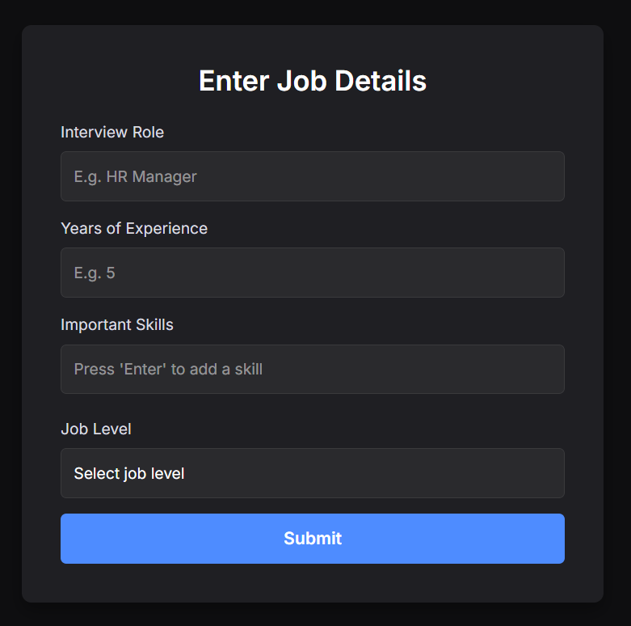

# AI Interviewer (General)

## 🌐 Live Demo

[Click here to access the AI Interviewer](http://ai-interviewer-general.sorsx.com/)

_(Note: Since this app is deployed using Heroku Eco Dynos, it may go into sleep mode when unused. The first question might give an error while fetching. Simply refresh the screen once, and it should function fine afterward.)_

---

## 📌 Overview

**AI Interviewer (General)** is an AI-powered, dynamic interviewer designed to conduct real-time, interactive text-based interviews.
Unlike traditional interview bots, this AI dynamically adapts its questions based on candidate responses and predefined parameters, ensuring a fluid and engaging interview experience.

### ✨ Features

- 🔄 **Adaptive Questioning:** The AI tailors its questions based on the candidate's responses and the initial parameters.
- 📝 **Real-Time Text-to-Text Interaction:** The interview occurs entirely via text with no audio or video components.
- 📊 **Dynamic Evaluation:** The AI processes candidate answers in real-time and generates follow-up questions accordingly.
- 📁 **Parameter-Based Customization:** Users can set predefined parameters to influence the interview direction.
- ⭐ **Difficulty Adjustment:** The AI dynamically adjusts question difficulty based on the candidate’s performance, ensuring an appropriate challenge level.

- 🔄 **Adaptive Questioning:** The AI tailors its questions based on the candidate's responses and the initial parameters.
- 📝 **Real-Time Text-to-Text Interaction:** The interview occurs entirely via text with no audio or video components.
- 📊 **Dynamic Evaluation:** The AI processes candidate answers in real-time and generates follow-up questions accordingly.
- 📁 **Parameter-Based Customization:** Users can set predefined parameters to influence the interview direction.

---

## 🛠️ How It Works

1. **User Input Parameters:** Candidates or recruiters provide key details to guide the interview.
   
2. **AI-Driven Interview:** The AI generates and refines questions in real-time based on responses.
3. **Seamless Interaction:** Candidates engage in a natural conversation-like interview.
   
4. **Evaluation & Feedback:** The AI adapts and continues the interview based on responses.

_(Replace `static/input.png` and `static/interview.png` with actual images demonstrating input parameters and interview flow.)_

---

## 🚀 Getting Started

### Prerequisites

Ensure you have the following installed:

- Python 3.x
- pip
- Virtual Environment (optional but recommended)
- Git

### Installation

```bash
# Clone the repository
git clone https://github.com/ibrahimm7004/ai-interviewer-generic.git
cd ai-interviewer-generic

# Create and activate a virtual environment (optional but recommended)
python -m venv venv
venv\Scripts\activate  # Windows
# or
source venv/bin/activate  # macOS/Linux

# Install dependencies
pip install -r requirements.txt

# Run the application
python app.py  # Adjust if a different entry file exists
```

---

## : 📂 Folder Structure

```
ai-interviewer-generic/
│── static/               # Static files (images, CSS, JS, etc.)
│── templates/            # HTML templates
│── app.py                # Main application script
│── requirements.txt      # Dependencies
│── README.md             # Project documentation
│── .gitignore            # Git ignored files
```

---

## 🛠️ Tools & Technologies Used

This project is built using the following technologies:

- 🔍 **Python** - Core programming language used for AI processing and logic.
- 🌐 **HTML/CSS** - For UI creation and styling, ensuring a smooth user experience.
- 🛏️ **Heroku** - Cloud hosting platform for easy deployment and scalability.
- 🛠 **Flask** - Web framework for handling server-side logic, API requests, and session management.
- 🧠 **OpenAI Assistants API** - Used for generating dynamic, real-time interview questions based on candidate responses.

---

## 💡 Future Ideas for Enhancement

- ✅ **Automatic Candidate Scoring:** AI will evaluate answers and generate a score based on predefined metrics.
- ✅ **Automated Report Generation:** The system will compile interview results into a report.
- ✅ **Email Integration:** The AI will automatically send the scoring report to an initially provided email.

---

## 📚 Related Work

This AI Interviewer is a **general-purpose** version of a previous **Salesforce-specific** AI interviewer.
The main difference is that this is a **General AI Interviewer**: Adapts to various roles with customizable parameters.

---
